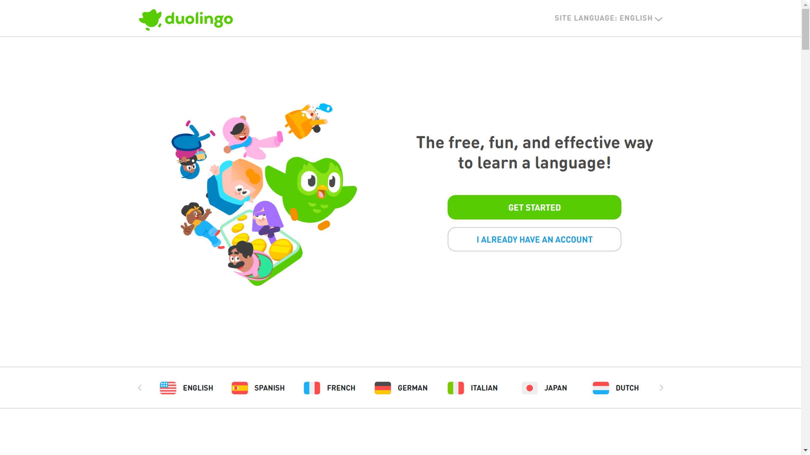

# 🌍 Duolingo Clone

## 🏆 Project Overview
This is a **fully responsive** **Duolingo Clone**, built using **HTML, CSS, and Bootstrap**. The aim of this project was to sharpen my frontend skills by replicating the user-friendly and interactive design of Duolingo. Through this, I improved my understanding of responsiveness, layout structuring, and Bootstrap components.

## 🎨 Visual Preview


## 🚀 Features
✅ Fully responsive design, adapting seamlessly across all devices 📱💻  
✅ Interactive UI elements styled with Bootstrap 🎨  
✅ Clean and structured layout, replicating the original Duolingo experience 🏗️  
✅ Optimized for a smooth user experience ⚡  

## 🛠️ How to Use
1. **Clone the repository**
   ```sh
   git clone https://github.com/Abuthahir-chalissery/Doulingo-Clone-Website.git
   ```
2. **Navigate to the project folder**
   ```sh
   cd Doulingo-Clone-Website
   ```
3. **Open `index.html` in a browser**
   ```sh
   Open index.html
   ```
4. **Explore the UI and Features**
   - Try different screen sizes to see the responsiveness in action.
   - Experience the navigation structure and styling similar to Duolingo.

## ❌ Challenges & Mistakes I Made
- Struggled with **aligning elements correctly on smaller screens** 📏
- Faced issues with **Bootstrap grid system usage** 🛠️
- Had to refine **spacing and typography for better readability** 🔍

## 🎯 Lessons Learned
- Mastered **Bootstrap’s grid system** for flexible layouts 🔄
- Improved understanding of **CSS media queries** for better control 📱
- Learned to **optimize responsiveness** for different screen sizes 🖥️
- Understood how to **structure and maintain scalable front-end projects** 🚀


## 📬 Contact & Feedback
For any queries or suggestions, feel free to reach out:  
📧 Email: abuthahirchalissery162@gmail.com


---

